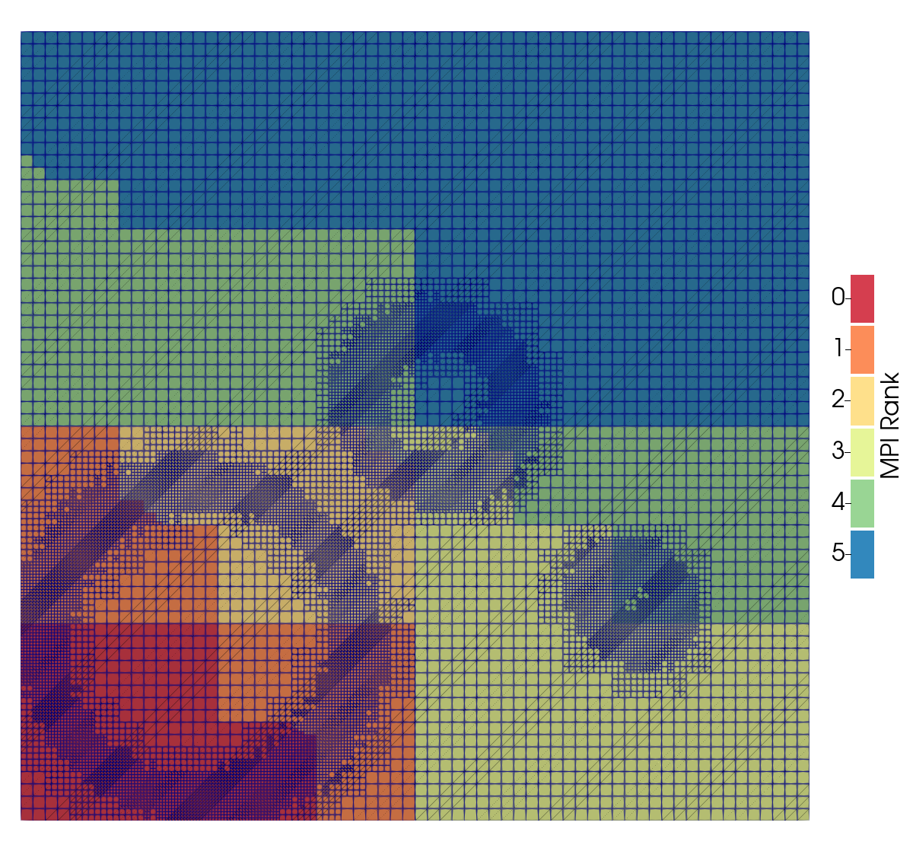
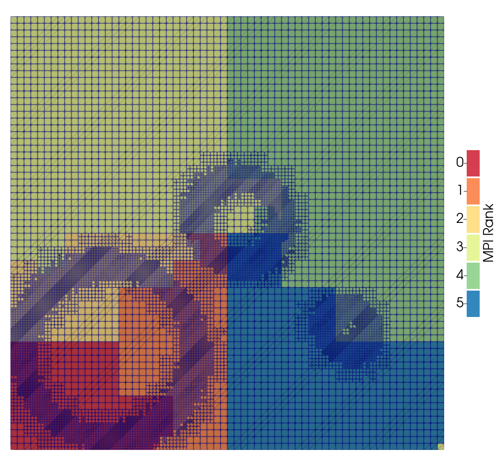

## New containers

```{=html}
<link href="https://cdn.jsdelivr.net/npm/bootstrap@5.3.0/dist/css/bootstrap.min.css" rel="stylesheet">
<script src="https://cdn.jsdelivr.net/npm/bootstrap@5.3.0/dist/js/bootstrap.bundle.min.js"></script>
```

- Add flexibility in container library dependencies
- Transparent for field usage
- Increase the performance (around 10%)
- Two available implementations : `xtensor` and `Eigen`
- In a near future, `Kokkos` implementation will be provided

## Algebra of sets

The algebra is not complete in samurai.

For example, it's not possible to write

:::{.my-4}
```{.cpp}
auto set = translation(intersection(mesh1, mesh2), {1, 0});
```
:::

A comprehensive rewrite of the system is underway to address these limitations.

With this new implementation, we can write :

:::{.my-4}
```{.cpp}
auto set = translate(intersection(translate(mesh1, {-2}).on(4),
                                  translate(mesh2,  {2}).on(3)),
                     {5}).on(10);
```
:::

## Load balancing

:::{.row .text-center}
::::{.col-6 .mx-auto}

::::
::::{.col-6 .mx-auto}

::::
:::

:::{.text-center .color}
Loïc Strafella work
:::

----

<!-- ::::{.center-page-vertically} -->

**What was achieved ?**

- Possibility to exchange any part of a mesh with its neighbors
- Update the sub domains and their fields according to this new rearrangement
- Load balancing using different algorithms
  - Morton curve
  - Hilbert curve
  - Diffusion algorithm

**What remains ?**

- All the techniques previously used are based on a cell view
- Understand the differences between this view and an interval view
- Try various strategies and find a *generic* criteria to achieve good load balancing
<!-- :::: -->

## Flux reconstruction

:::{.text-center}
<div>
<video data-autoplay width="70%" src="videos/burgers/MRA_upwind_without_portion-min_1-max_12-eps_0.01-reg_0.mp4" />
</div>
:::

:::{.text-center .mt-0}
without: $\epsilon = 1e-2$, $\underline{\ell} = 2$, $\bar{\ell} = 12$
:::

## Flux reconstruction

:::{.text-center}
<div>
<video data-autoplay width="70%" src="videos/burgers/MRA_upwind_with_portion-min_1-max_12-eps_0.01-reg_0.mp4" />
</div>
:::

:::{.text-center .mt-0}
with: $\epsilon = 1e-2$, $\underline{\ell} = 2$, $\bar{\ell} = 12$
:::

## Flux reconstruction

:::{.row .align-items-center}
::::{.col-6 .text-center}
<video data-autoplay src="videos/portions/portion.mp4" />
::::

::::{.col}
**What was achieved ?**

- Implementation of an algorithm which can reconstruct the solution anywhere
  - used for flux reconstruction
  - used for field transfers
  - used to reconstruct the solution at the finest level

**What remains ?**

- Flux reconstruction activated by the user
- Fix the graduation according to the prediction order
- Improve the linear coefficients computation and storage by using an `unordered_map`
::::
:::

## Optimization

## Packaging

:::{.my-4}
samurai is available on `conda-forge` and `conan`.
:::

In the NumPEx context, samurai must also be installed with Spack and Guix.
In the next few months, we will provide a way to install it through these package managers.

:::{.text-center .mt-4}
{width="10%"}
{width="10%"}
:::

## Restart

:::{.row .align-items-center}
::::{.col-5}

::::
::::{.col .fragment}
This raises a number of questions

- How to select a list of fields in a restart file ?
- How to give them back to the user ?
- Can we have a generic output for restart and plot ?
- Is it convenient to have post processing scripts ?
::::
:::

## A dual Splitting/IMEX strategy for stiff PDEs {.fs-5}

:::{.row .fs-6 .align-items-center}

::::{.col-6}
Belousov-Zhabotinsky (very stiff source - 3 eq)
$$
\left\{
\begin{aligned}
\partial_t a - D_a \, \Delta a &= \frac{1}{\mu} ( -qa - ab
+
fc) \\
\partial_t b - D_b \, \Delta b &= \frac{1}{\varepsilon} (
qa
- ab + b\,(1-b)) \\
\partial_t c - D_c \, \Delta c &= b - c
\end{aligned}
\right.
$$

- Error to the reference quasi-exact solution is second order in time but not of the same origin (splitting error vs. IMEX error) - but still error control
- Larger time step can be taken with IMEX while keeping a proper solution (no disastrous splitting errors - wrong wave speed)
- When optimal large splitting time step is taken, IMEX as efficient as splitting, whereas it is advantageous for smaller time steps as well as larger time steps
- No boundary condition problems
- Same computational good properties

:::{.callout-important icon=false title="Simulation with ponio / samurai"}
:::
::::
::::{.col-6 .text-center}
:::{.text-center .mt-0}
$\epsilon = 1e-3$, $\underline{\ell} = 2$, $\bar{\ell} = 10$
:::
<video data-autoplay loop="true" src="videos/bz_pirock_animation.mp4" width="90%" />
::::
:::

## NASA Roadmap covering the five projects

**Mandatory**

- Distinguish between a scalar field and a vector field.
- Implement scaling according to spatial directions
- Restart implementation
- Sequential optimizations
- Load balancing strategy
- Various finite volume scheme available out of the box (MUSCL, rusanov, HLL, ...) with or without flux reconstruction

**Optional**

- Post-processing scripts
- Problem greater than 3 dimensions (e.g. plasma problems)
